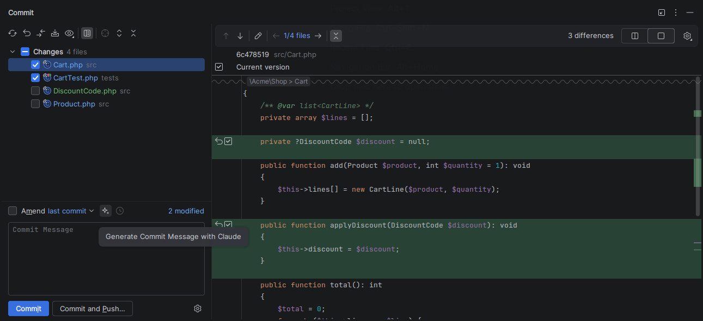
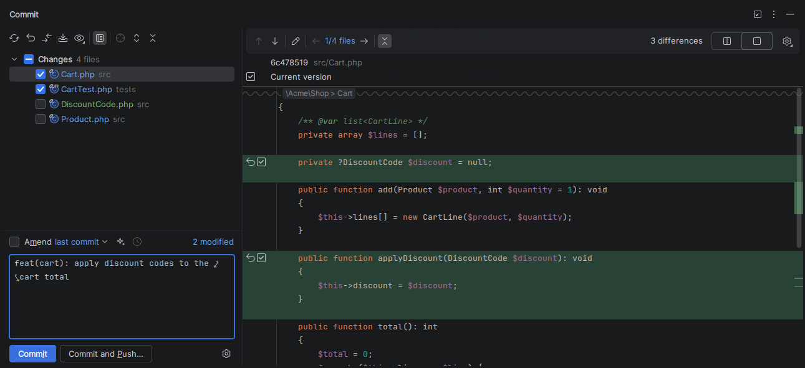
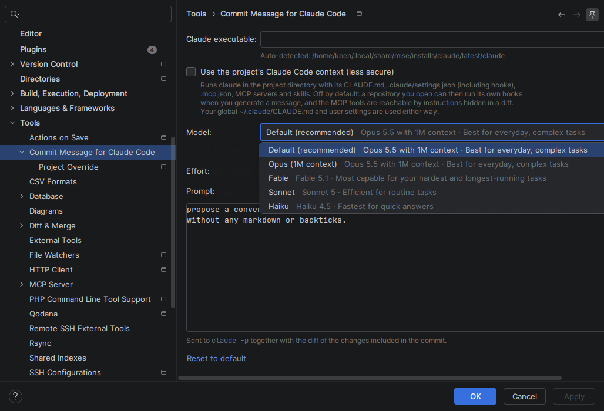

# Commit Message for Claude Code

<!-- Plugin description -->
Generates commit messages with your locally installed [Claude Code](https://claude.com/product/claude-code) CLI, right from the commit tool window.

Click the button in the commit message toolbar and the plugin sends the diff of the changes you included in the commit to `claude -p`, then fills in the commit message. Files and lines you unchecked are left out, so partial commits get a message that matches what is actually committed. Click the button again to cancel.

**Features**

- Uses your own Claude Code login or API key; no extra account or key to configure.
- Configurable prompt. The default asks for a [Conventional Commits](https://www.conventionalcommits.org/) message.
- Model and effort selection, with the model list read from the CLI.
- Per-project override of prompt, model and effort.
- Isolated by default: the repository you are committing to cannot inject hooks, MCP servers or instructions into the CLI. You can opt in to the project's Claude Code context instead.

**Requirements**

- Claude Code installed and logged in (`claude` works in a terminal).
- Works in any JetBrains IDE with version control support, 2026.2 or newer.

The diff of the selected changes is sent to Anthropic through your Claude Code CLI, under your own Claude Code account and its terms.

This is an independent plugin. It is not made, endorsed or supported by Anthropic. Claude and Claude Code are trademarks of Anthropic, PBC.
<!-- Plugin description end -->

## Screenshots

The button sits next to the commit message history icon. Only the checked files and lines are sent, so here the unrelated `Product.php` and the not yet included `DiscountCode.php` are left out:





The model list comes straight from the Claude Code CLI:



## Settings

**Settings | Tools | Commit Message for Claude Code**

- **Claude executable**: leave empty to auto-detect from `PATH` and common install locations.
- **Use the project's Claude Code context**: opt-in, off by default. See [Security](#security).
- **Model**: filled from the CLI with the refresh button. The CLI has no command that lists models, so the plugin sends the stream-json `initialize` control request (no prompt, no token usage) and reads the model list from the response.
- **Effort**: limited to the levels the selected model supports.
- **Prompt**: sent on stdin after the diff, never as a command line argument.

**Project Override** (child page) stores prompt, model and effort for the current project in `.idea/claudeCommitMessage.xml`.

## Security

The diff and a project override can come from a repository you do not control, so by default the CLI runs isolated. Your global `~/.claude/CLAUDE.md` and user settings are still used.

- Working directory is a private folder in the IDE system directory, not the project, so the repository's `CLAUDE.md` and `.mcp.json` are never read.
- `--setting-sources user` ignores the repository's `.claude/settings.json`, whose hooks would otherwise run without a trust prompt in `-p` mode.
- `--tools ""` plus `--strict-mcp-config` leaves the model with no tools at all (`--tools ""` alone keeps every MCP tool), and `--disable-slash-commands` turns off skills. Injected instructions in a diff can only change the suggested text, which you review before committing.
- Prompt and diff go through stdin, so a prompt starting with `-` cannot be parsed as a CLI option. Model and effort are validated and passed as `--model=value` / `--effort=value`.
- `--no-session-persistence` keeps diffs out of `~/.claude` transcripts.
- The executable path and the project context option are global settings only; a project file cannot change which binary runs or opt itself out of isolation.

Enabling **Use the project's Claude Code context** drops the first three points: claude runs in the project directory and loads its `CLAUDE.md`, `.claude/settings.json` (hooks included), `.mcp.json`, MCP servers and skills. Built-in tools stay disabled and the stdin, validation and session persistence protections still apply, but a repository you open can then run its own hooks when you click the button. The model list is always fetched in isolated mode.

## Build

```sh
./gradlew buildPlugin                                    # downloads PhpStorm 2026.2.2 to compile against
./gradlew buildPlugin -PplatformLocalPath=/opt/phpstorm  # or use a local install
./gradlew runIde -PplatformLocalPath=/opt/phpstorm       # sandbox IDE with the plugin loaded
./gradlew test verifyPlugin                              # verifies against the recommended IDE versions
```

Install `build/distributions/commit-message-for-claude-code-*.zip` with **Settings | Plugins | ⚙ | Install Plugin from Disk…**.

## License

[MIT](LICENSE)
